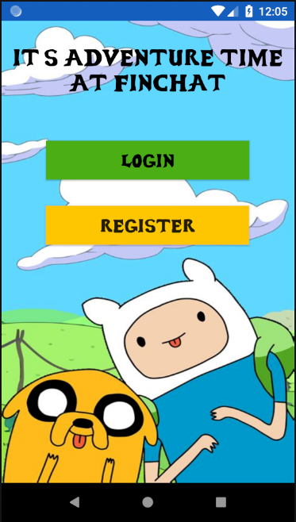
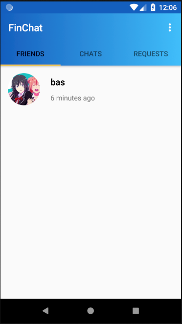
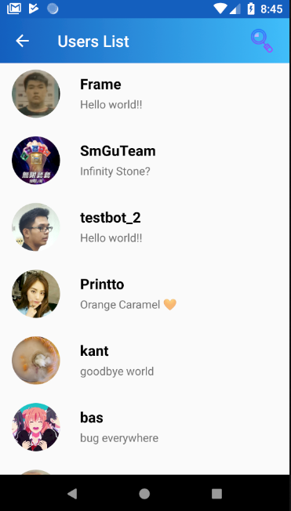

# FinChat :zap:

#### Chat application on Android devices base on Line application and Finn from Adventure Time theme.

## Screenshot of FinChat
#### FinChat Final v1.8.1    

StartPage|MainPage|UsersPage|ProfilePage
--|--|--|--
|||  

#### FinChat Final v2.3
StartPage|MainPage|UsersPage|ProfilePage
--|--|--|--
|||  

<!-- #### StartPage


#### MainPage


#### UsersPage


#### ProfilePage
   -->

## Tools :hammer:
- **Android Studio 3.3.1**
  - **Library**<br>
    <!-- - Picasso
    - Glide
    - RecycleView
    - CircleImageView
    - Android-image-cropper -->
    ```implementation 'de.hdodenhof:circleimageview:3.0.0'
    implementation 'com.squareup.picasso:picasso:2.71828'
    implementation 'com.android.support:recyclerview-v7:28.0.2'
    api 'com.theartofdev.edmodo:android-image-cropper:2.8.+'
    implementation 'androidx.recyclerview:recyclerview:1.0.0'
    implementation 'com.github.bumptech.glide:glide:4.9.0'
    annotationProcessor 'com.github.bumptech.glide:compiler:4.9.0'```
- **Firebase** <br>  
  <!-- - Firebase-auth:16.0.3
  - Firebase-core:16.0.3
  - Firebase-database:16.0.1
  - Firebase-storage:16.0.1
  - Firebase-messaging:17.3.2   -->
  ```implementation 'com.google.firebase:firebase-auth:16.0.3'
    implementation 'com.google.firebase:firebase-core:16.0.3'
    implementation 'com.google.firebase:firebase-database:16.0.1'
    implementation 'com.google.firebase:firebase-storage:16.0.1'
    implementation 'com.google.firebase:firebase-messaging:17.3.2'```

## Function :wrench:
- **Users Function**  
  - Login/Register
  - See all users
  - Change image profile, cover profile, and status
  - Search all users
  - Add, cancel, and decline friend request
  - Receive notification when chat incoming, and added friend
- **Chats Function**
 - Can send many type of message
    - Plain text/ Hyperlink
    - Image (including .gif)
    - PDF file (still bug if file is too big)
